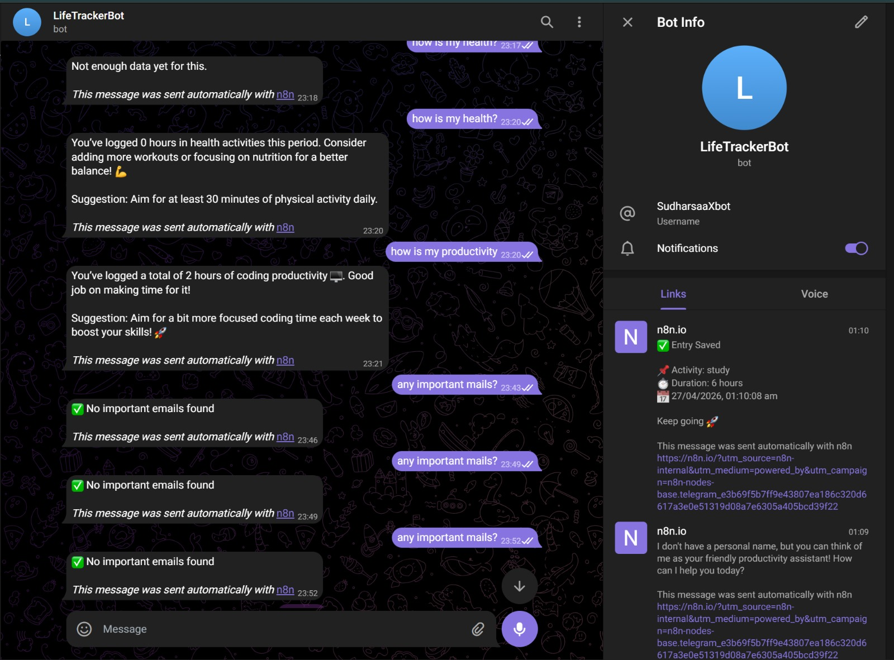
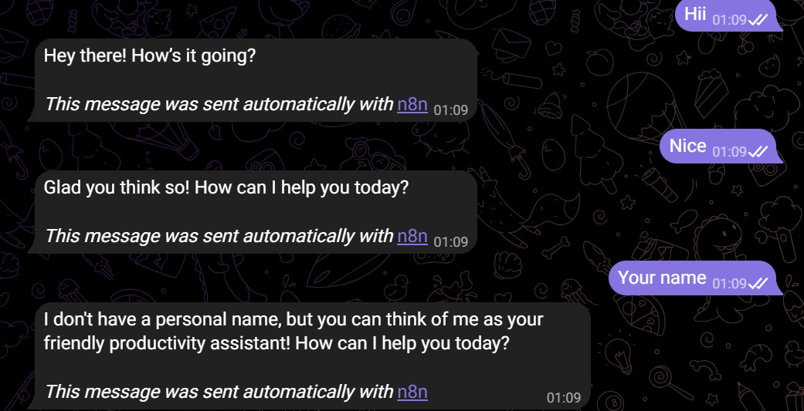
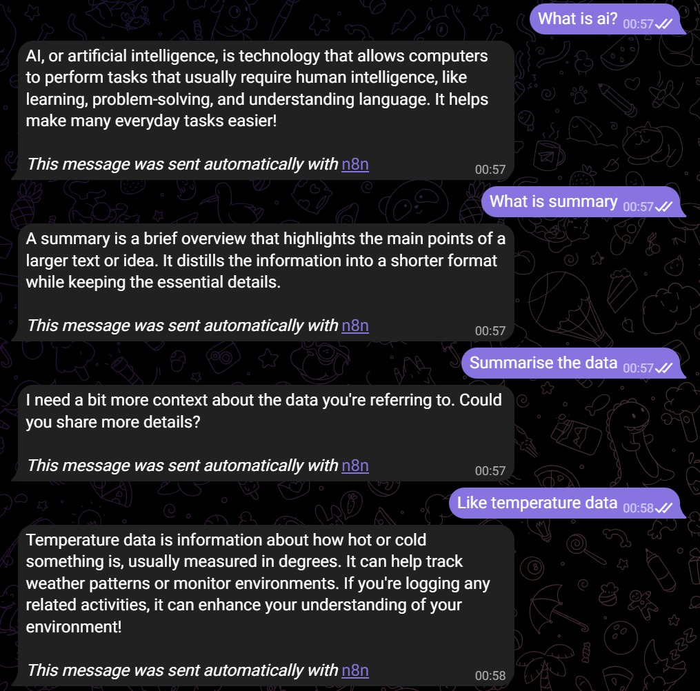
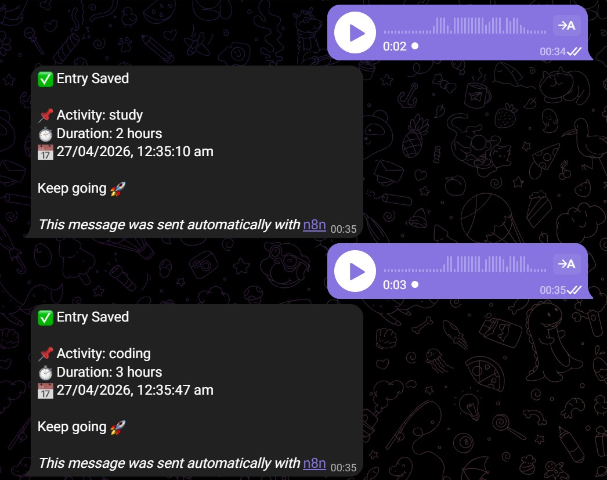
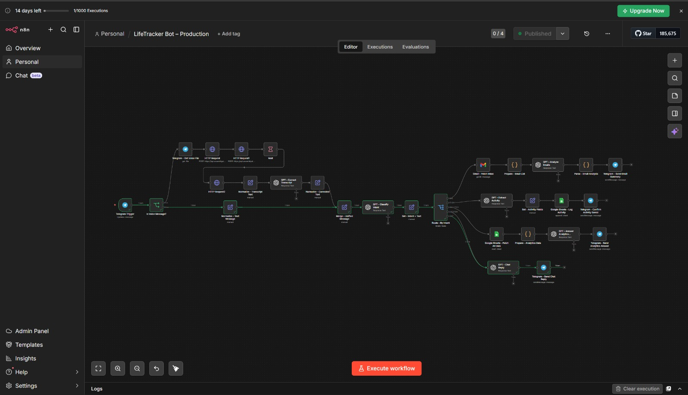
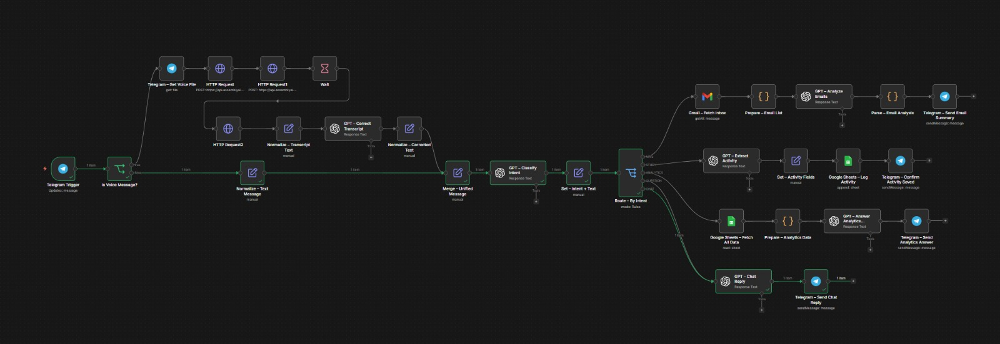
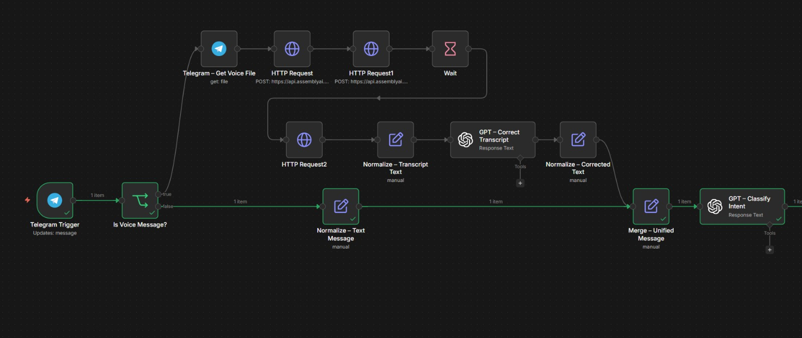
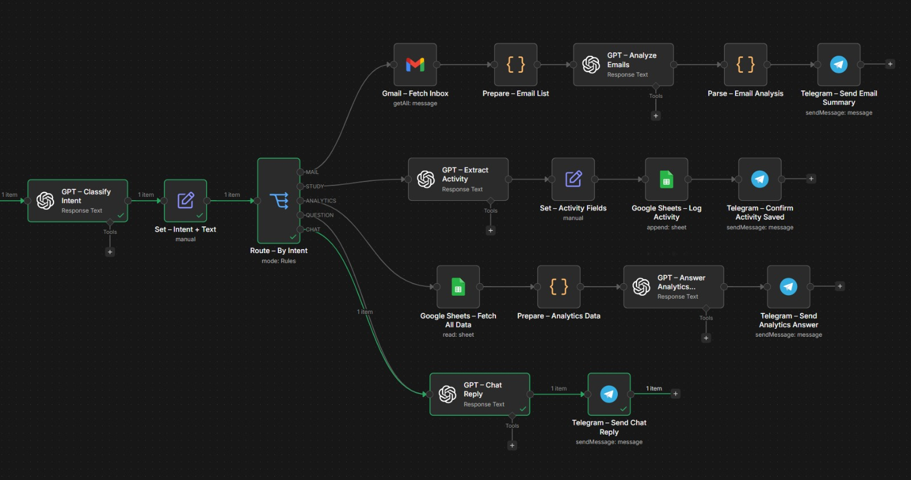

# LifeTracker Bot

LifeTracker Bot is a simple productivity tracking system built using n8n, Telegram, and AI. It allows users to log daily activities using text or voice messages, automatically processes the input, and stores the data for later analysis.

The goal of this project is to make activity tracking easy and natural, without relying on manual input or complex applications.

---

## Overview

Instead of opening apps and manually logging tasks, users can just send a message like:

* "I studied 2 hours"
* "I coded for 3 hours"
* or send a voice note

The system understands the input, extracts useful information, and saves it in Google Sheets. It can also answer questions about productivity and filter important emails.

---

## Features

* Supports both text and voice input
* Converts voice messages into text
* Uses AI to understand activities and duration
* Automatically logs data into Google Sheets
* Provides basic productivity insights
* Filters important emails such as internships or deadlines
* Includes a simple chat assistant

---

## How It Works

1. User sends a message through Telegram
2. Voice input is converted into text
3. The message is cleaned and standardized
4. AI classifies the intent (activity, analytics, email, or chat)
5. Activity data is extracted and structured
6. Data is stored in Google Sheets
7. A response is sent back to the user

---

## Project Structure

```
LifeTracker-Bot/
│── LifeTracker_Bot-n8n_filtered.json
│── telegram_screenshots/
│── workflow_screenshots/
│── README.md
```

---

## Setup Instructions

1. Clone the repository:

   ```
   git clone https://github.com/SudharsaaX/LifeTracker-Bot.git
   ```

2. Open n8n and import the workflow file:

   * LifeTracker_Bot-n8n_filtered.json

3. Configure the required credentials:

   * Telegram Bot API
   * OpenAI API
   * Google Sheets API
   * AssemblyAI API

4. Activate the workflow

---

## Screenshots

### Telegram Interaction

<table>
  <tr>
    <td></td>
    <td></td>
  </tr>
  <tr>
    <td></td>
    <td></td>
  </tr>
</table>

---

## Workflow Overview



## Workflow Breakdown

<p align="center">
  
  
  
</p>
---

## Example Usage

```
I studied 2 hours
I worked out for 1 hour
How much did I code today?
Any important emails?
```

---

## Notes

Make sure to replace all API keys and credentials with your own before running the workflow.
Do not upload sensitive information to public repositories.

---

## Future Improvements

* Visual dashboard for analytics
* Weekly and monthly reports
* Habit tracking
* Reminder system

---

## Author

Sudharsan
https://github.com/SudharsaaX

---

## License

This project is for learning and personal use.
