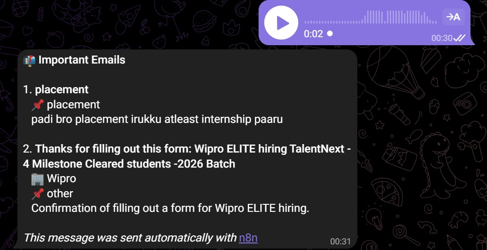
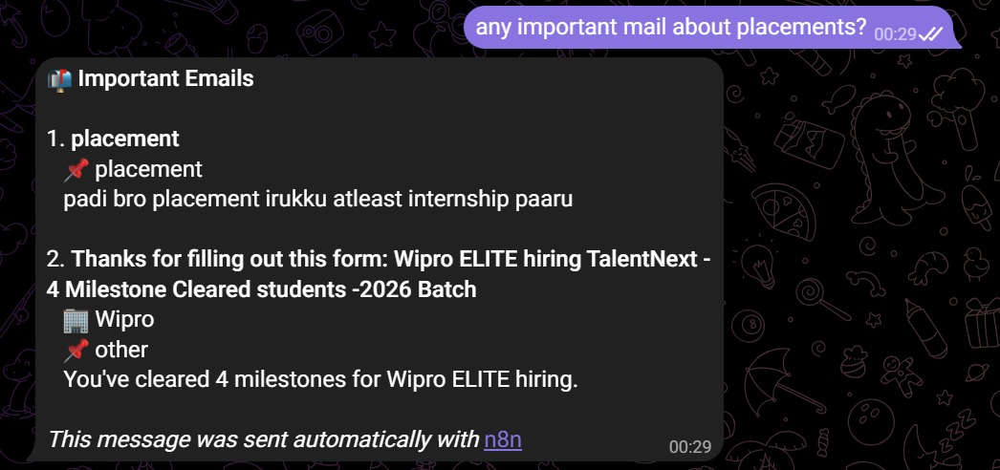
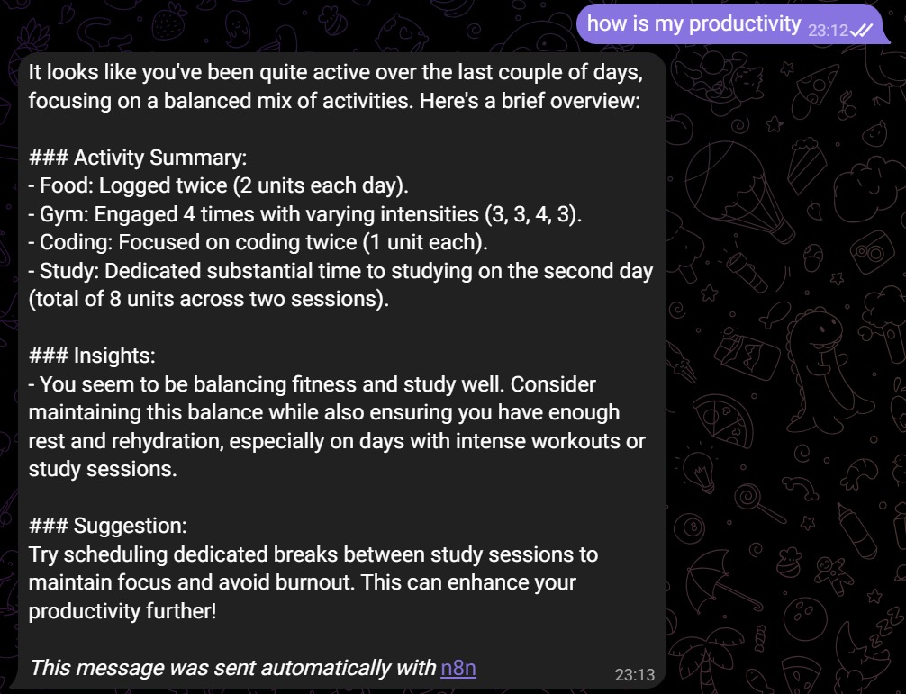

# LifeTracker Bot

LifeTracker Bot is a productivity tracking system built using n8n, Telegram, and AI. It allows users to log daily activities through simple text or voice messages, automatically processes the input, and stores the data for later analysis.

The goal of this project is to make activity tracking simple, natural, and effortless.

---

## Overview

Instead of manually logging tasks, users can send messages like:

* "I studied 2 hours"
* "I coded for 3 hours"
* or a voice note

The system understands the input, extracts useful data, and stores it in Google Sheets. It can also provide insights and filter important emails.

---

## Features

* Text and voice-based activity logging
* Speech-to-text conversion
* AI-powered activity and time extraction
* Automatic logging to Google Sheets
* Productivity insights
* Email importance detection
* Simple AI chat assistant

---

## Telegram Interaction

### Full Interaction

<p align="center">
  <a href="telegram_screenshots/telegram-0.jpeg">
    
  </a>
</p>

<p align="center"><i>Complete interaction showing activity tracking, analytics queries, and email checks.</i></p>

---

### Activity Logging

<p align="center">
  <a href="telegram_screenshots/telegram-1.jpeg">
    
  </a>
  <a href="telegram_screenshots/telegram-2.jpeg">
    
  </a>
</p>

<p align="center"><i>Logging activities using simple text or voice messages. The system automatically detects type and duration.</i></p>

---

### Analytics and Insights

<p align="center">
  <a href="telegram_screenshots/telegram-3.jpeg">
    
  </a>
  <a href="telegram_screenshots/telegram-4.jpeg">
    
  </a>
</p>

<p align="center"><i>Users can ask questions about their productivity and receive summarized insights.</i></p>

---

### Email Detection and Chat

<p align="center">
  <a href="telegram_screenshots/telegram-5.jpeg">
    
  </a>
  <a href="telegram_screenshots/telegram-6.jpeg">
    
  </a>
</p>

<p align="center"><i>Detection of important emails and basic conversational chat support.</i></p>

---

## Workflow Overview

<p align="center">
  <a href="workflow_screenshots/complete-workflow.jpeg">
    
  </a>
</p>

<p align="center"><i>Complete n8n workflow showing message processing, AI handling, and integrations.</i></p>

---

## Workflow Breakdown

<p align="center">
  <a href="workflow_screenshots/workflow1.jpeg">
    
  </a>
  <a href="workflow_screenshots/workflow2.jpeg">
    
  </a>
</p>

<p align="center"><i>Key sections of the workflow including intent classification, activity extraction, and response handling.</i></p>

---

## How It Works

1. User sends a message through Telegram
2. Voice input is converted into text
3. AI cleans and understands the message
4. Intent is classified
5. Activity data is extracted
6. Data is stored in Google Sheets
7. A response is sent back

---

## Project Structure

```
LifeTracker-Bot/
│── LifeTracker_Bot-n8n_filtered.json
│── telegram_screenshots/
│── workflow_screenshots/
│── README.md
```

---

## Setup Instructions

1. Clone the repository

```
git clone https://github.com/SudharsaaX/LifeTracker-Bot.git
```

2. Import the workflow into n8n

* LifeTracker_Bot-n8n_filtered.json

3. Configure credentials

* Telegram Bot API
* OpenAI API
* Google Sheets API
* AssemblyAI API

4. Activate the workflow

---

## Example Usage

```
I studied 2 hours
I worked out for 1 hour
How much did I code today?
Any important emails?
```

---

## Notes

Replace all API keys with your own before running.
Do not expose sensitive credentials.

---

## Future Improvements

* Analytics dashboard
* Weekly and monthly reports
* Habit tracking
* Notifications and reminders

---

<p align="center">
  
</p>

<h3 align="center">Sudharsan</h3>

<p align="center">
  <a href="https://github.com/SudharsaaX">
    
  </a>
</p>

---
